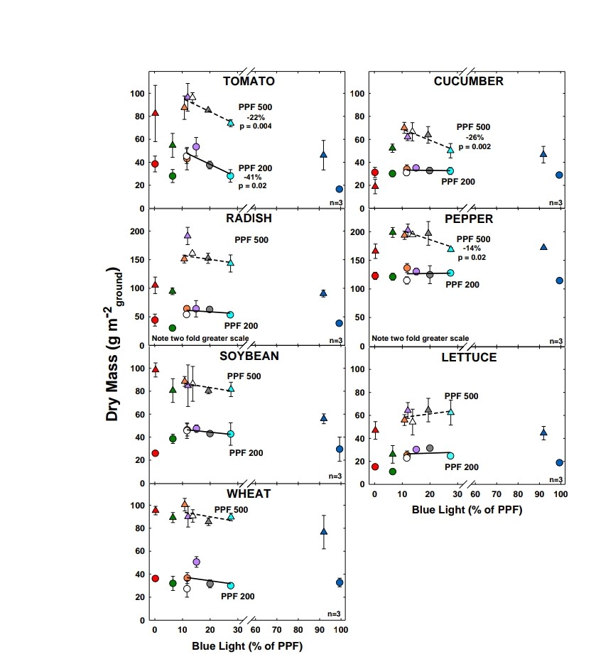

# Spectra : The Diet app for plants

---
Description : The Project is called Spectra. We are developing an mobile application to interface with an embedded system to control spectrum intensity
of Red(R),Blue(B),Green(G) and Infrared(IR) lights and analyze the growth rate and photosynthesis rate of specific plants.

We are generally focusing on the plant growth and intensity required for that. Monitoring plant condition and phenology is crucial for understanding relationships between climate variability, environmental conditions, vegetation health, and productivity. Plant phenology is directly related to climatic variations.The most common indices utilize the differential response of vegetation in near infrared (NIR) and red (R) or other visible bands.

Then the researched data can be uploaded to the cloud using a database which can be further used by farmers to assist them with plant growth and what intensity they can use for their specific plant types. It will be helpful for both researchers and farmers and cultivators 
for analyzing and using light spectrum intensity for the better growth and sustainability of plants.

---

## Tech Stack used :
 - [**Flutter**](https://flutter.dev/)
 - [**Dart**](https://dart.dev/)
 - [**Python**](https://www.python.org/)

---
## Plant growth graph using RGB and IR values : 

